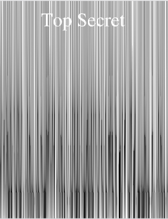
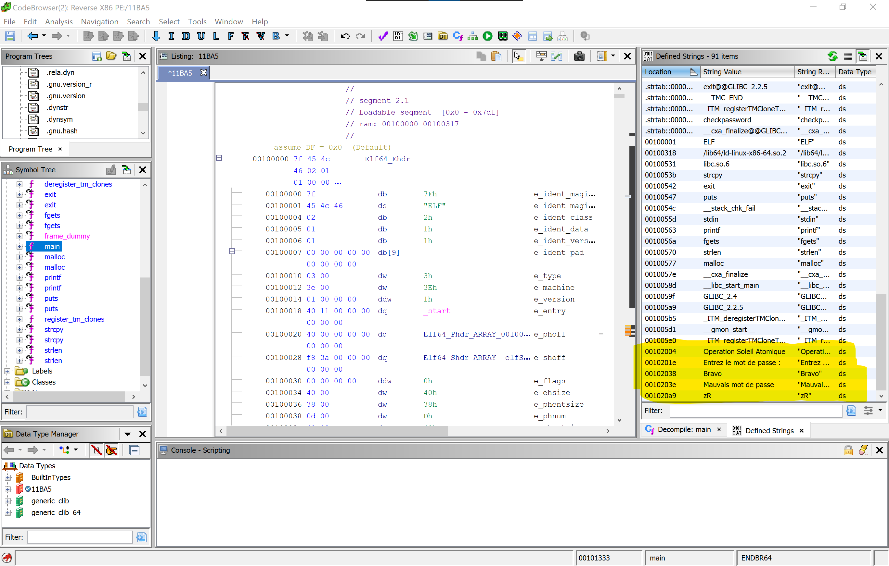
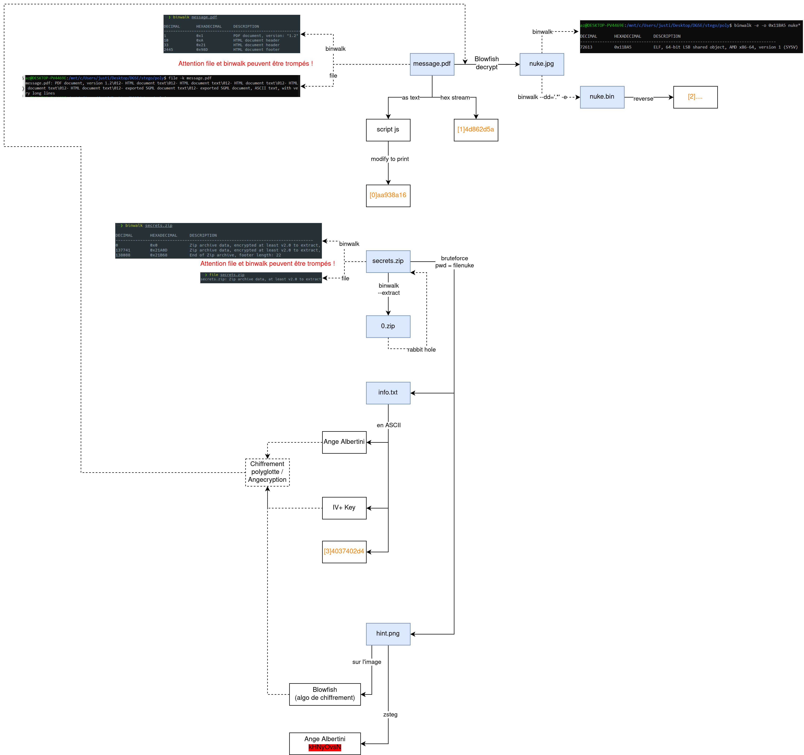

# Challenge Brigitte Friang - Le Polyglotte

> by Julien BEDEL & Alexandre RIOU, équipe InSecurity

## Description du challenge

- Nom : "Le Polyglotte" 
- Catégorie : Stéganographie
- Description :

> Nous avons intercepté un fichier top secret émanant d'Evil Country, il  est très certainement en rapport avec leur programme nucléaire. Personne n'arrive à lire son contenu. 
>
>  Pouvez-vous le faire pour nous ? Une archive était dans le même dossier, elle peut vous servir
>
>  Le flag est de la forme : DGSESIEE{x} avec x un hash que vous trouverez
>
>  message.pdf  (SHA256=e5aa5c189d3f3397965238fbef5bc02c889de6d5eac713630e87377a5683967c) :  http://challengecybersec.fr/d3d2bf6b74ec26fdb57f76171c36c8fa/message.pdf
>  secrets.zip  (SHA256=ae5877bb06ac9af5ad92c8cd40cd15785cbc7377c629ed8ec7443f251eeca91f) :  http://challengecybersec.fr/d3d2bf6b74ec26fdb57f76171c36c8fa/secrets.zip

## Étude des fichiers téléchargés

### *message.pdf*

#### Utilisation "naïve"

D’après l’extension il semblerait que le fichier soit un PDF. Il se lance d'ailleurs sans problème dans un lecteur de PDF et présente alors les mots “Top Secret” puis d’étranges bandes noires verticales.



Malgré plusieurs tentatives (code barre, redimensionnement, etc) nous n'arrivons pas à exploiter les bandes verticales. Heureusement il reste bien d'autres informations à aller chercher sur des fichiers en stéganographie !


#### Vérification du type de fichier

Notons également qu'un `file message.pdf` reconnaît le fichier comme de la donnée binaire brute, et non un PDF classique, il y a donc probablement quelque chose de particulier dans sa construction et son contenu..

On nous indique d'ailleurs dans la description qu’on dispose d’un fichier dont "personne n’arrive a lire le contenu". De plus, le mot "polyglotte" évoque en informatique des fichiers qui disposent de plusieurs types à la fois, pouvant alors être interprétés différemment selon leur contexte d’utilisation, il y a probablement quelque chose à aller chercher de ce côté.

Si un autre fichier "entier" est présent dans *message.pdf* alors il sera facilement identifiable via des [magic bytes](https://en.wikipedia.org/wiki/List_of_file_signatures) permettant de l'identifier. L'outil *binwalk* peut être utilisé : `binwalk -Me message.pdf` mais ne donne rien de concluant. Il existe toutefois des méthodes plus avancées de créer des fichiers polyglottes, que nous verrons par la suite.

#### Recherche de contenu caché

Il arrive souvent en stéganographie qu’on cache une chaîne de caractère (voir même un fichier) dans un autre. Plusieurs méthodes “traditionnelles” existent comme ajouter la donnée cachée à la fin du fichier binaire, dans les métadonnées, ou encore cacher l’information dans les bits de poids faible d’une image (rendant la modification invisible à l’œil nu) avec la fameuse technique du “Least Significant Byte” ou LSB.

J’aime bien commencer par suivre [la checklist de StegOnline](https://stegonline.georgeom.net/checklist) pour me faire une première idée de ce que peut cacher le fichier.

On va commencer par simplement ouvrir notre fichier dans un éditeur de texte affichant les caractères imprimables. Gardons en tête la [structure d'un document PDF](https://resources.infosecinstitute.com/topic/pdf-file-format-basic-structure/) afin d'identifier des anomalies, et donc potentiellement des données cachées.

Bingo ! On identifie plusieurs plusieurs chaînes hexadécimales entre chevrons qui ne semblent correspondre à rien de commun pour un PDF :

```
<5b 31 5d 34 64 38 36 32 64 35 61>

<43 65 20 64 6f 63 75 6d 65 6e 74 20 63 6f 6e 63 65 72 6e 65 20 6c 20 6f 70 65 72 61 74 69 6f 6e 20 73 6f 6c 65 69 6c 20 61 74 6f 6d 69 71 75 65 2e 0a 43 65 74 74 65 20 6f 70 65 72 61 74 69 6f 6e 20 65 73 74 20 73 74 72 69 63 74 65 6d 65 6e 74 20 63 6f 6e 66 69 64 65 6e 74 69 65 6c 6c 65 20 65 74 20 6e 65 20 64 6f 69 74 20 65 6e 20 61 75 63 75 6e 20 63 61 73 20 ea 74 72 65 20 64 65 76 6f 69 6c 65 65 2e 20 0a 4c 65 73 20 69 6e 66 6f 72 6d 61 74 69 6f 6e 73 20 73 75 72 20 6c 20 6f 70 65 72 61 74 69 6f 6e 20 73 6f 6e 74 20 64 69 73 73 65 6d 69 6e e9 65 73 20 64 61 6e 73 20 63 65 20 66 69 63 68 69 65 72 2e 0a 43 68 61 71 75 65 20 70 61 72 74 69 65 20 64 65 20 6c 20 69 6e 66 6f 72 6d 61 74 69 6f 6e 20 65 73 74 20 69 64 65 6e 74 69 66 69 65 65 20 70 61 72 20 75 6e 20 6e 6f 6d 62 72 65 20 70 61 72 20 65 78 20 3a 20 0a 5b 30 5d 61 65 37 62 63 61 38 65 20 63 6f 72 72 65 73 70 6f 6e 64 20 61 20 6c 61 20 70 72 65 6d 69 e8 72 65 20 70 61 72 74 69 65 20 64 65 20 6c 20 69 6e 66 6f 72 6d 61 74 69 6f 6e 20 71 75 20 69 6c 20 66 61 75 74 20 63 6f 6e 63 61 74 65 6e 65 72 20 61 75 20 72 65 73 74 65 2e>
```

En décodant l'hexadécimale sous forme ASCII, on obtient en effet des chaînes de caractères intéressantes :

```
[1]4d862d5a

Ce document concerne l operation soleil atomique.
Cette operation est strictement confidentielle et ne doit en aucun cas être devoilee. 
Les informations sur l operation sont disseminées dans ce fichier.
Chaque partie de l information est identifiee par un nombre par ex : 
[0]ae7bca8e correspond a la première partie de l information qu il faut concatener au reste.
```

On comprends donc que le flag final est une concaténation de chaînes au format `[x]...` incrémentant, suivi de 4 bytes en hexadécimal, et on en a déjà un morceau !

On identifie également un document HTML et du code JavaScript présentant une variable *flag* très intéressante.. Il est coupé mais on reconstitue facilement le code suivant :

```javascript
var flag = [91,48,93,97,97,57,51,56,97,49,54];
for(i=0;i<flag.length;i++) {
    flag[i] = flag[i]+4
}
alert(String.fromCharCode.apply(String, flag));
```

En l'exécutant on obtient la chaîne `_4aee=7<e5:`, a priori rien de très probant a priori.  On se dit que la boucle `for` est peut être juste utilisé pour mélanger les caractères et rendre le tout incompréhensibles, essayons de la supprimer. Ça marche, on trouve finalement `[0]aa938a16` !

Après plusieurs heures à inspecter la donnée binaire présente dans le fichier et les rayures noires du PDF on repère pas mal de donnée étrange pour un PDF mais que nous ne parvenons pas a interpréter. Notons pourtant la phrase "les informations sur l’opération sont disséminées dans ce fichier" qui semble indiquer que toutes les parties d'information à trouver sont effectivement dans le PDF. Il nous faut donc probablement plus d'informations pour l'interpréter correctement. Ça tombe bien, nous disposons d'un second fichier *secrets.zip* pour essayer d'en apprendre plus.

### *secrets.zip*

Cette fois-ci a priori pas de triche, un `file secrets.zip` nous confirme qu'il s'agit d'un fichier compressé on ne peut plus classique, mais protégé par un mot de passe. Tentons un attaque par force brute des mots de passe avec une wordlist couramment utilisée en CTF : *rockyou.txt*. J'ai l'habitude de dire "si rockyou ne passe pas, c'est que la solution n'était pas un bruteforce" (à tort ou à raison..).

Utilisons l'outil fcrackzip qui fait justement ça : 

```bash
fcrackzip --use-unzip --dictionary --init-password rockyou.txt secrets.zip
PASSWORD FOUND!!!!: pw == finenuke
```

On utilise le mot de passe et trouvons alors deux fichiers : *hint.png* et *info.txt*.

### *info.txt*

Même si le flag semble être intégralement caché dans *message.pdf* on effectue rapidement les vérifications classiques avec `file` et `binwalk` : il s'agit d'un simple fichier ASCII, voyons son contenu :

```
Ange Albertini
key='\xce]`^+5w#\x96\xbbsa\x14\xa7\x0ei'
iv='\xc4\xa7\x1e\xa6\xc7\xe0\xfc\x82'
[3]4037402d4
```

Prenons le ligne par ligne :

- *Ange Albertini*, une recherche sur Google nous informe qu’il s’agit de l’auteur de *[Corkami](https://corkami.github.io/)*, un site présentant diverses expérimentations informatique, notamment sur les formats de fichiers ! Il a probablement travaillé sur les fichiers polyglottes, il faudra creuser dans le contenu qu’il propose.
- La suite *key* et *iv* fait référence à du chiffrement, de multiples algorithmes utilisent de tels paramètres particulièrement dans le cas des *block ciphers*.
- La dernière ligne nous donne un nouveau fragment du flag !

### *hint.png*

Même chose pour ce fichier, on vérifie son type avec `file` et `binwalk`, il s'agit bien d'un PNG classique. Passons rapidement sur StegOnline, pas grand chose si ce n'est la chaîne "Ange Albertini" présente dans le fichier.

Enfin, si on s'intéresse au contenu propre de l'image on constate qu'il représente un poisson-globe ou "blowfish" en anglais. [Blowfish](https://fr.wikipedia.org/wiki/Blowfish) est également un algorithme de chiffrement utilisant un clé et un vecteur d'initialisation, couplé à *info.txt* on en déduit qu'il s'agit de chiffrer ou déchiffrer quelque chose, mais quoi ?

#### Wrapping up

Essayons de faire le lien entre les infos trouvées dans *secrets.zip* et *message.pdf*. Après quelques recherches sur internet en essayant de mettre en lien la notion de chiffrement et de fichier polyglotte, le tout autour d'Ange Albertini, on tombe sur un de ses sujets de recherche : l'utilisation de différentes méthodes pour transformer un fichier en un autre par chiffrement.

Le tout est détaillé dans un cours d'Ange [disponible sur Youtube](https://www.youtube.com/watch?v=wbHkVZfCNuE), on découvre au passage l'outil Angecryption utilisé pour créer des tels fichiers.

## Récupération des derniers flags

### "Chiffrement polyglotte"

D'après ce qu'on a pu voir dans le cours d'Ange Albertini, on va essayer de chiffrer ou déchiffrer la donnée binaire de *message.pdf* via l'algorithme Blowfish. À titre indicatif voilà le code Python utilisé, directement adapté de l'exemple de la documentation de [pycrytodome](https://pycryptodome.readthedocs.io/en/latest/src/cipher/blowfish.html) :

```python
from Crypto.Cipher import Blowfish
from struct import pack

BS = Blowfish.block_size
KEY = b'\xce]`^+5w#\x96\xbbsa\x14\xa7\x0ei'
IV = b'\xc4\xa7\x1e\xa6\xc7\xe0\xfc\x82'

with open('message.pdf', 'rb') as f:
    file_data = f.read()
    
plen = BS - len(file_data) % BS
padding = [plen]*plen
padding = pack('b'*plen, *padding)
cipher = Blowfish.new(KEY, Blowfish.MODE_CBC, IV)
data = cipher.encrypt(file_data + padding)

with open('encrypted', 'wb') as f:
    f.write(data)

print('Success!')
```

Et ça marche ! En chiffrant le fichier *message.pdf* on obtient une image au format JPG représentant une explosion :


### Découverte et cracking de l'exécutable

On va maintenant chercher à analyser le dernier fichier que nous avons obtenus. On exécute un classique *binwalk* sur le fichier pour découvrir si il n'y a pas de fichiers cachés :

```bash
$ binwalk encrypted 

DECIMAL       HEXADECIMAL     DESCRIPTION
--------------------------------------------------------------------------------
72613         0x11BA5         ELF, 64-bit LSB shared object, AMD x86-64, version 1 (SYSV)
```

Bingo ! On découvre qu'un binaire exécutable a été caché à l'offset *0x11BA5* dans l'image que nous venons d'extraire, il semble que le challenge de stégano se transforme désormais en cracking.. Encore une fois *binwalk* nous est d'une grande aide pour extraire l'exécutable avec un `binwalk -e --dd=".*" encrypted` (*encrypted* étant l'image jpg).

Avant de le désassembler l’exécutable, commençons par simplement le lancer afin d'observer son comportement en conditions "normales" (attention à le faire dans un environnement isolé/sandboxé (une machine virtuelle par exemple) car il pourrait s'agir d'un malware. Ici le fichier provient de la DGSE dans le cadre d'un CTF donc le risque est moindre, mais je lance quand même le fichier sur ma VM Kali Linux :

```bash
$ chmod +x && ./extracted.bin 
Operation Soleil Atomique
Entrez le mot de passe : mot_de_passe
Mauvais mot de passe
```

Lors de l'exécution, le programme demande un mot de passe qui est sûrement testé, mais on ne peut pas en tirer plus d'information. 

On ouvre l'ELF avec le désassembleur de notre choix (ici nous utiliserons *Ghidra*).  Une des premières choses que l'on peut regarder est si le mot de passe est enregistré en dur dans le code. 



On retrouve les différents messages que l'on a pu voir à l'exécution mais aucune trace de mot de passe. 

Intéressons nous maintenant aux fonctions du programme. On remarque particulièrement une fonction *checkpassword* qui pourrait s'avérer très intéressante. Mais avant d'entamer l'analyse de cette fonction, nous allons nous intéresser à différents éléments de la fonction *main* : 

- Où et quels sont les (éventuels) paramètres passés à la fonction *checkpassword* ?
- Comment le retour de *checkpassword* est-il utilisé ?
- Comment l'entrée utilisateur est-elle récupérée puis utilisée ?

On remarque que l'entrée utilisateur est récupérée et stockée en *[RBP - 0x20]*.

```asm
0x0000000000001382 <+79>:	lea    rax,[rbp-0x20]
0x0000000000001386 <+83>:	mov    esi,0x10
0x000000000000138b <+88>:	mov    rdi,rax
0x000000000000138e <+91>:	call   0x1110 <fgets@plt>
```

Par la suite, cette chaine de caractère est copié dans la section *heap* via un `malloc` et `strcpy`. Un pointeur vers la chaine de caractère est ensuite passé dans RDI pour être utilisé dans *checkpassword*. Mais une chose parait déjà étonnante : aucune valeur de retour n'est envoyée par *checkpassword* alors que le test indiquant quel message retourner à l'utilisateur (succès ou échec) se situe bien plus tard dans la fonction *main*, étrange donc.. 

Effectivement, en observant de plus près *checkpassword*, on découvre que la fonction n'utilise aucun paramètre et ne renvoie aucune valeur de retour.

```asm
0x0000000000001316 <+237>:	jle    0x12f1 <checkpassword+200>
0x0000000000001318 <+239>:	mov    eax,0x0
0x000000000000131d <+244>:	mov    rcx,QWORD PTR [rbp-0x8]
0x0000000000001321 <+248>:	xor    rcx,QWORD PTR fs:0x28
0x000000000000132a <+257>:	je     0x1331 <checkpassword+264>
0x000000000000132c <+259>:	call   0x10f0 <__stack_chk_fail@plt>
0x0000000000001331 <+264>:	leave  
0x0000000000001332 <+265>:	ret
```

On devine donc que la fonction *checkpassword* est inutile et n'est qu'un piège ! On va plutôt s'intéresser à la suite de la fonction main. Nous pouvons observer qu'elle effectue une suite de XOR entre notre chaine de caractères et des caractères mis dans la *stack*, ainsi que des comparaisons. 

On peut ici utiliser la fonction de décompilation de Ghidra qui nous génère du code C, facilitant grandement la compréhension de l'algorithme (même si on aurait également pu décortiquer l'assembleur).

Voici le code généré par Ghidra : 

```c
undefined8 main(void)

{
  size_t sVar1;
  byte *__dest;
  long in_FS_OFFSET;
  char local_28 [24];
  long local_10;
  
  local_10 = *(long *)(in_FS_OFFSET + 0x28);
  puts("Operation Soleil Atomique");
  printf("Entrez le mot de passe : ");
  fgets(local_28,0x10,stdin);
  sVar1 = strlen(local_28);
  __dest = (byte *)malloc(sVar1 + 1);
  strcpy((char *)__dest,local_28);
  checkpassword(__dest);
  if (((((((__dest[1] ^ *__dest) == 0x69) && ((__dest[2] ^ __dest[1]) == 0x6f)) &&
        ((__dest[3] ^ __dest[2]) == 0x38)) &&
       (((__dest[4] ^ __dest[3]) == 0x56 && ((__dest[5] ^ __dest[4]) == 0x50)))) &&
      (((__dest[6] ^ __dest[5]) == 0x57 &&
       (((__dest[7] ^ __dest[6]) == 0x50 && ((__dest[8] ^ __dest[7]) == 0x56)))))) &&
     (((__dest[9] ^ __dest[8]) == 6 && (__dest[9] == 0x34)))) {
    puts("Bravo");
                    /* WARNING: Subroutine does not return */
    exit(0);
  }
  puts("Mauvais mot de passe");
  if (local_10 != *(long *)(in_FS_OFFSET + 0x28)) {
                    /* WARNING: Subroutine does not return */
    __stack_chk_fail();
  }
  return 0;
}
```

On remarque qu'à chaque test on utilise le caractère suivant pour effectuer notre XOR, sauf pour le dernier caractère. Il faut donc partir du dernier caractère et remonter dans les indices pour obtenir notre code secret. Un simple script Python permet d'effectuer les opérations inverses :

```python
codexor = [0x69,0x3F,0x6F,0x38,0x68,0x3E,0x06,0x69]
egal = [52,111,105,63,111,56,104,62,6,105]
result = [0,0,0,0,0,0,0,0,0,52]

i = 1
while(i < 9):
    t = egal[i]^codexor[i-1]
    t = t^result[len(result)-i]
    result[len(result)-i-1] = t
    i+=1

t = egal[9]
t = t^result[1]
result[0]=t

print("Result : ", end="")
for c in result:
    print(chr(c), end="")
print("")
```

On trouve finalement le dernier code `[2]e3c4d24`. On peut vérifier que l'on a le bon mot de passe en lançant le programme : 

```bash
$ ./extracted.bin
Operation Soleil Atomique
Entrez le mot de passe : [2]e3c4d24
Bravo
```

### Validation du challenge

On a bien le bon mot de passe, il ne reste plus qu'à reformer le hash à partir des différentes parties et le tour est joué !

> FLAG : DGSESIEE{aa938a164d862d5ae3c4d244037402d4}

## Bonus : organisation à l'aide d'une mind map

On ne s'en rend pas forcément compte à la lecture du writeup, mais lorsqu'on s'attaque à un challenge de ce type on peut se retrouver facilement perdu face à la multitude d'indices et de pistes potentielles. Par exemple ici on avait des infos potentiellement cachées sur une multitude de fichiers extraits. 

C'est pourquoi nous avons construit une mind map des différents fichiers et indices que nous pouvions trouver lors du challenge. Voici à quoi elle ressemblait à la fin du challenge (normalement exportée suffisamment grande pour qu'on puisse zoomer dessus) :


